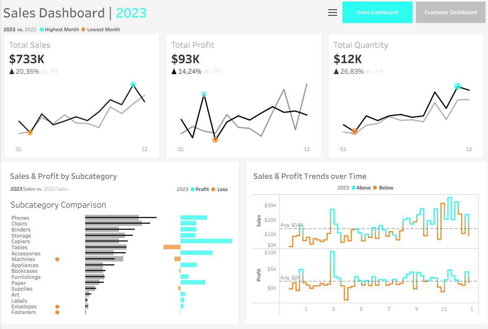

# 📊 Sales Dashboard – Tableau Project

An interactive sales dashboard built in **Tableau**, presenting sales data analysis
covering the years **2020–2023**.

Project created as part of the course:
> **Tableau Ultimate Full Course - From Zero to HERO**

---

## 📁 Data Source

Data based on the Superstore dataset, consisting of four related tables:

| Table     | Description                                      |
|-----------|--------------------------------------------------|
| Orders    | Orders – sales, profit, quantity, discounts      |
| Customers | Customer data and segments                       |
| Products  | Product categories and subcategories             |
| Location  | Geographic locations of orders                   |

---

## 📈 Current Dashboard Scope

### Sales Dashboard
- **KPI Cards** – Total Sales, Total Profit, Total Quantity with YoY comparison (% vs PY)
- **Highlighting** of the best and worst performing months (Highest / Lowest Month)
- **Sales & Profit by Subcategory** – 2023 vs 2022 comparison with profit/loss indicators
- **Sales & Profit Trends over Time** – monthly trends with average reference line
  
 ### Interactive Controls & Legend
When expanding the filter/legend panel, the following controls are available:

- **Select Year** – dropdown to dynamically switch the year displayed across all views
- **Measure Names** filter – allows toggling individual measures on/off, including:
  - `Min/Max Sales` – highlights the best and worst sales months
  - `Min/Max Profit` – highlights the best and worst profit months
  - `Min/Max Quantity` – highlights the best and worst quantity months
  - `CY Profit` – current year profit bars (scale visible, e.g. up to ~$35K)
  - `CY Sales` – current year sales bars (scale: $1K – $35K)
  - `KPI Profit Avg` – reference line showing average profit threshold

  

### Calculated Fields (selected)
- `Current Year` / `Previous Year` – dynamic year filtering
- `% Diff Sales`, `%Diff Profit`, `%Diff Quantity` – year-over-year growth
- `KPI Sales Avg`, `KPI Profit Avg`, `KPI CY Less PY` – performance indicators
- `Min/Max Sales`, `Min/Max Profit`, `Min/Max Quantity` – highlighting extreme months

---

## 🚧 Planned Development

- [ ] **Customer Dashboard** – customer analysis: segments, top customers, retention
- [ ] **Geographic Map** – sales map by state/region using Latitude & Longitude
- [ ] **Product Analysis** – category profitability, discount vs profit analysis
- [ ] **Interactive Filters** – dynamic selection of year, category, and region
- [ ] **Forecasting** – sales forecasting using Tableau's built-in forecast feature
- [ ] **Story Points** – narrative summary of results for presentation purposes

---

## 🛠️ Tools & Technologies

- **Tableau Desktop / Tableau Public**
- Raw data in `.csv` format

---

## 🎓 Course

This project is being built as part of the course:
**Tableau Ultimate Full Course - From Zero to HERO**

---

## 📌 Notes

The project is actively in development — new views and analyses will be added
progressively.
